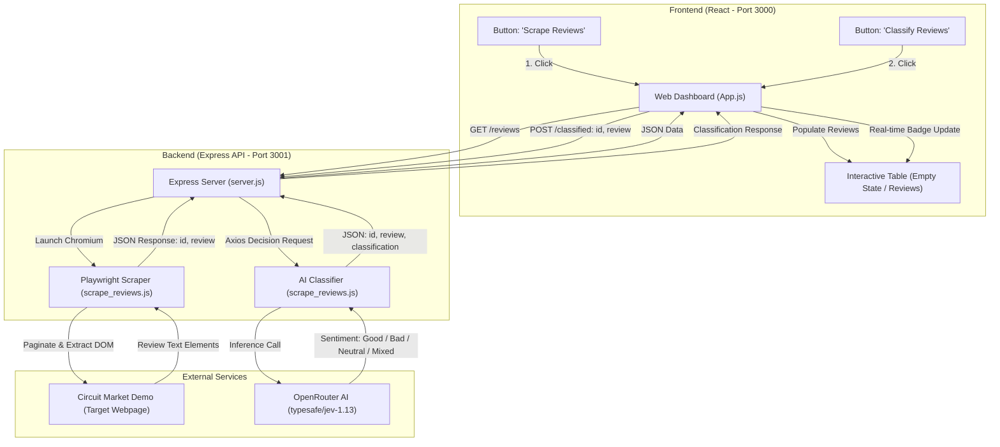
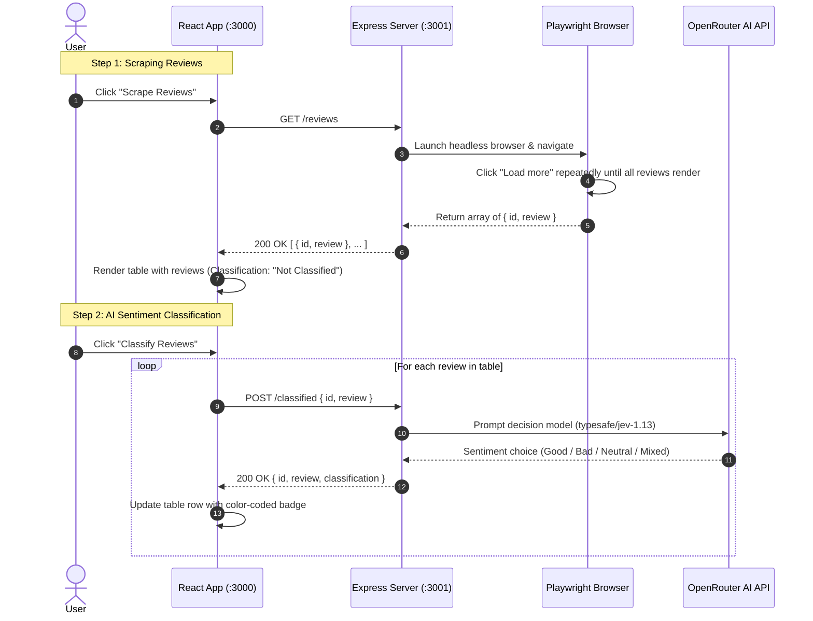

# Customer Review Scraper & Sentiment Classification System

An end-to-end full-stack application that scrapes customer reviews from an e-commerce website using **Playwright**, classifies review sentiment using **OpenRouter AI**, and presents the results in an interactive **React** frontend.

---

## About the Project

E-commerce businesses receive continuous customer feedback across diverse hardware products. Analyzing this volume of text manually is time-consuming and subjective. 

This project provides an automated pipeline:
- **Dynamic Web Scraping**: Automates a headless browser using Playwright to handle dynamic client-side rendering and pagination ("Load more" button) to collect all customer reviews from the [Circuit Market Demo Store](https://circuit-market-demo.vercel.app/reviews).
- **AI-Powered Sentiment Classification**: Integrates with OpenRouter (`typesafe/jev-1.13` decision model) to classify sentiment into discrete categories: `Good`, `Bad`, `Neutral`, or `Mixed`.
- **In-Memory Streaming & Real-Time Dashboard**: Completely decouples storage from data flow; scraped reviews and AI classifications are served directly over REST APIs and updated incrementally on an interactive React table.

---

## Architecture Diagram



### Detailed Execution Flow



---

## Project Structure

```text
NodeJSClassification/
├── README.md               # Project documentation & architecture
├── .gitignore              # Git ignore rules for root, backend & frontend
├── Backend/                # Express backend & Playwright scraper
│   ├── .env                # Environment variables (API keys)
│   ├── package.json        # Backend dependencies & start scripts
│   ├── scrape_reviews.js   # Scraper logic & OpenRouter decision client
│   └── server.js           # Express REST API routes & CORS middleware
└── frontend/               # React single-page dashboard
    ├── package.json        # Frontend dependencies (React 19, Axios)
    ├── public/             # Static web assets
    └── src/
        ├── App.js          # Main dashboard component with table & controls
        ├── App.css         # Styling for table, buttons & badges
        └── index.js        # React DOM entry point
```

---

## Prerequisites & Setup

Ensure you have **Node.js** (v18 or higher) installed on your system.

### 1. Configure Backend Environment

Navigate to the `Backend` directory and install the required dependencies:

```bash
cd Backend
npm install
npx playwright install chromium
```

Create a `.env` file in the `Backend` folder:

```env
PORT=3001
OPENROUTER_API_KEY=your_openrouter_api_key_here
```

> **Note**: Obtain an API key from [OpenRouter.ai](https://openrouter.ai).

### 2. Configure Frontend

In a separate terminal, navigate to the `frontend` directory and install dependencies:

```bash
cd frontend
npm install
```

*(Optional)* Create a `.env` in `frontend/` if running the backend on a custom port:

```env
REACT_APP_API_URL=http://localhost:3001
```

---

## Process Needed to Run the Project

### Step 1: Start the Backend Server

From the project root:

```bash
cd Backend
npm start
```

The Express server will start on `http://localhost:3001`:
```text
Server is running on port 3001 (http://localhost:3001)
```

### Step 2: Start the Frontend Application

Open a second terminal window from the project root:

```bash
cd frontend
npm start
```

The React app will launch automatically at `http://localhost:3000`.

### Step 3: Use the Dashboard

1. **Initial View**: The table starts empty with a clean prompt to begin.
2. **Scrape Reviews**: Click **"Scrape Reviews"**. Playwright navigates to Circuit Market, loads all reviews dynamically, and displays them in the table with sequential IDs.
3. **Classify Reviews**: Click **"Classify Reviews"**. The frontend sequentially sends each review to the AI classification endpoint and updates the row status in real time with styled badges:
   - 🟢 `Good`: Positive customer feedback.
   - 🔴 `Bad`: Defect, complaint, or hardware failure.
   - ⚪ `Neutral`: Factual or objective description.
   - 🟡 `Mixed`: Contains both positive and negative aspects.

---

## API Reference

| Method | Endpoint | Description | Request Body | Response |
| :--- | :--- | :--- | :--- | :--- |
| `GET` | `/health` | Health check endpoint | None | `{ "status": "ok", "timestamp": "..." }` |
| `GET` | `/reviews` | Scrapes all reviews from Circuit Market | None | `[ { "id": 1, "review": "..." }, ... ]` |
| `POST` | `/classified` | Classifies sentiment for a review | `{ "id": 1, "review": "text" }` | `{ "id": 1, "review": "text", "classification": "Good" }` |
